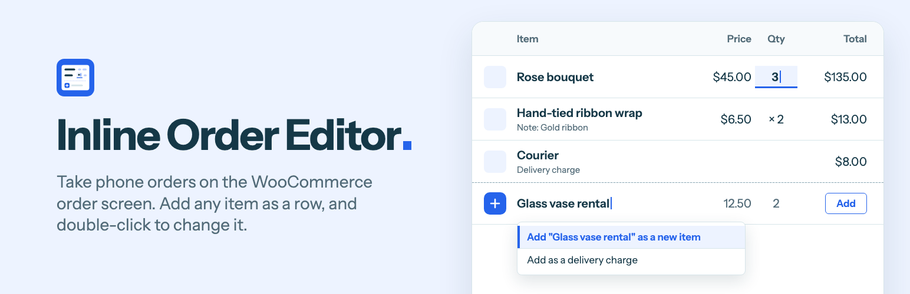
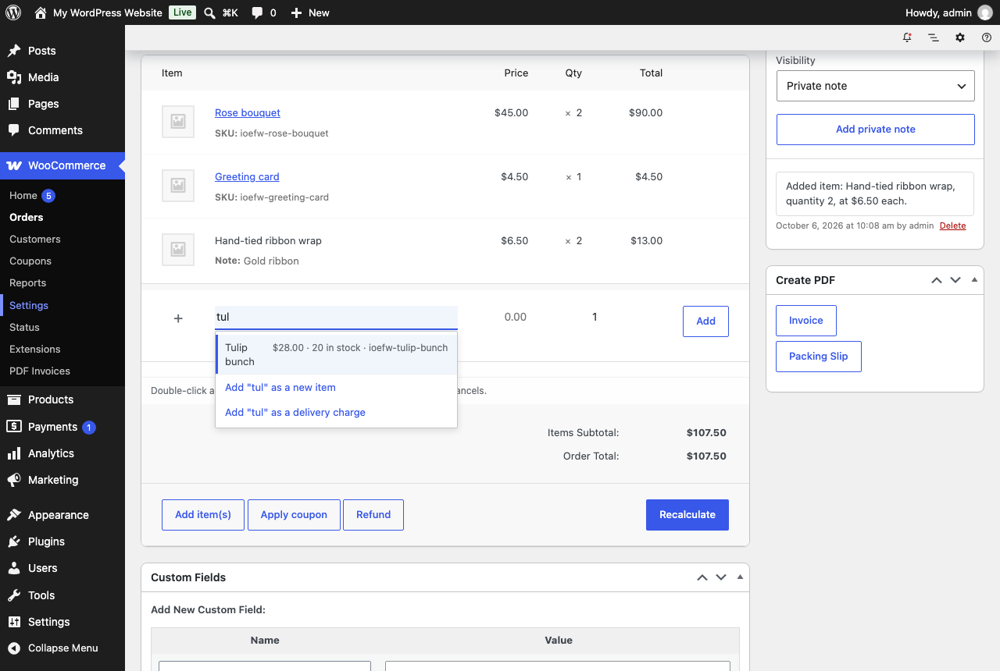

# Inline Order Editor for WooCommerce

Take phone orders on the WooCommerce order screen: add any item as a new row, double-click to change a line, and add terms to order emails.

It is for shops that take orders by phone, over the counter or by message, and type them in under WooCommerce > Orders. There is no new screen to learn. The plugin adds three things to the order screen you already use.



## What it adds

**An empty row for the next item.** Type a name and pick a product from your catalogue, or keep typing to add something that is not in it, with a price, a quantity and an optional note. The same row adds a delivery charge. Enter adds the line and a fresh row is ready.

**Double-click to change a line.** Price each, quantity and total are changed where they stand, with no fields popping open and nothing moving. Enter saves, Esc cancels, Tab saves and moves on. Items you typed in can be renamed, and fees and delivery charges can be renamed and repriced the same way.

**Order terms.** A box on each order for payment, delivery or return terms, filled in from a default you set once. The customer sees them in order emails and on their order page, and they print on invoices made by PDF Invoices & Packing Slips for WooCommerce.

After every change the order's taxes and totals are calculated again, and a toast at the bottom of the screen says what happened: "Saved. The order total is now $65.00. It was $50.00." Each change also leaves a private order note with the old and the new value.

The plugin also warns you when you pick the Draft status. WooCommerce deletes Draft orders by itself about a day after their last change, which catches out shops that park unfinished orders there.

## How it works

- **Catalogue products are added by WooCommerce.** Picking a suggestion sends WooCommerce's own `woocommerce_add_order_item` request, so stock and other extensions behave as they do with the Add product(s) button.
- **A typed item is a normal line item with no product.** It is the shape WooCommerce leaves behind when a product is deleted, plus a hidden marker, `_ioefw_custom`. A delivery charge is a shipping line.
- **Changes to a line are saved by `wc_save_order_items()`**, the function behind the order screen's own Save button. Stock adjustments, order notes and other extensions' hooks fire as they do there.
- **Taxes and totals follow the Recalculate button**: `calculate_taxes()` for the address in the form, then `calculate_totals()`. If the store's prices are entered with tax, typed amounts are read with tax and converted with the rates WooCommerce found for the line.
- **The Items box is redrawn from the server after every save**, with WooCommerce's own template. The fields WooCommerce posts when you click Update therefore always match what was saved.
- **Each request carries a fingerprint of the order's lines.** If the order changed somewhere else in the meantime, nothing is saved and the screen is brought up to date.
- **Update waits for a save in flight.** Clicking Update while a value is still open saves that value first, then submits the form.
- **Terms are a copy on the order**, in the meta key `_ioefw_order_terms`. Changing the default later does not rewrite earlier orders.
- **Messages are toasts.** They go through the WordPress notices store as snackbars, which WooCommerce's admin screens already draw and read out. Where that is not on the page, the script shows a small toast of its own.

There is no build step. The screen is one script and one stylesheet, loaded only where a single order is edited.

## Limits worth knowing

- Lines can be changed on orders WooCommerce treats as editable: Pending payment, On hold, and new orders. A paid order has to go back to Pending payment first. An order with a refund is left alone.
- Percentage and fixed product coupons apply to catalogue products only, so a typed item keeps its price. A fixed cart coupon is shared across every line. This is WooCommerce's rule.
- A typed item has no stock, SKU or weight. Analytics > Products has no product to list it under, so typed items appear there together in one row, marked "(Deleted)".
- Changing a line recalculates the order's taxes, so a tax amount typed by hand with the pencil is replaced.
- On an order with a coupon, a line's total follows the coupon, so only its price and quantity are typed. Each change applies the order's coupons again, which replaces a discount typed by hand on any line.
- Not tested on a real phone or tablet, or with subscriptions, bookings, product bundles, or tax services such as WooCommerce Tax and Avalara.

## What it leaves out, on purpose

A panel of reviewers argued the feature list before any code was written. These were turned down for the first version:

- **Unlocking paid orders.** Once money has moved, the charged amount stops matching the order.
- **Saving in the background.** Every save here is one you made, with Enter, Tab or by leaving the field.
- **Turning a typed item into a live product.** A note taken on the phone should not become a public listing.
- **Payment links by WhatsApp or SMS.** WooCommerce already emails the order details with a pay link.

## Hooks

| Filter | What it does |
| --- | --- |
| `ioefw_can_edit_order` | Whether an order's lines may be changed here. Receives the decision and the order. |
| `ioefw_editable_fields` | Which of `name`, `price`, `quantity` and `total` can be changed on a line. |
| `ioefw_custom_item_args` | A typed item's name, quantity, price, note and tax class before it is added. |
| `ioefw_amounts_include_tax` | Whether typed amounts include tax. Follows the store's tax setting by default. |
| `ioefw_order_terms` | An order's terms before they are shown. Receives the text, the order, and `email`, `order_page`, `pdf` or `view`. |
| `ioefw_show_terms_in_email` | Whether one email shows the terms. |
| `ioefw_pdf_document_types` | Which PDF documents show the terms. Invoices by default. |
| `ioefw_product_search_limit` | How many catalogue products the new row suggests. |

| Action | When it fires |
| --- | --- |
| `ioefw_loaded` | The plugin has loaded. Add-ons start here. |
| `ioefw_custom_item_added` | A typed item was added and totals were settled. |
| `ioefw_delivery_added` | A delivery charge was added and totals were settled. |
| `ioefw_item_updated` | A line was changed. Receives the line ID, the order, and the values before and after. |
| `ioefw_after_recalculate` | The plugin recalculated an order's taxes and totals. |
| `ioefw_terms_saved` | An order's terms were saved or removed. |
| `ioefw_terms_box_actions` | The links under the Order terms box are being printed. Receives the order. |

`ioefw_get_order_terms( $order )` returns an order's terms as plain text, for a PDF or email template. `IOEFW_Orders::add_custom_item()`, `add_delivery()` and `update_item()` do the same work the screen does, for code that wants to call them.

In the browser, `ioefw:mounted` and `ioefw:saved` fire on `document`, and `window.ioefw.getState()` returns the order as the server last drew it. An add-on's own request can answer with `IOEFW_Ajax::fragments( $order )` and hand that to `window.ioefw.draw()`, then say what happened with `window.ioefw.notice()`.

## Requirements

WordPress 6.8 or later, WooCommerce 10.0 or later, PHP 7.4 or later. Version 1.0.3 has the same code as 1.0.2 and adds a changelog file to the package. Version 1.0.2 was tested on WordPress 7.1.3 with WooCommerce 11.1.2 and PHP 8.5, and on WordPress 6.8.10 with WooCommerce 10.0.6 and PHP 7.4. Both ran with HPOS, and the newer stack also ran with post-based order storage.

## Install

Build the plugin as shown below and upload `build/inline-order-editor-for-woocommerce.zip` under Plugins > Add Plugin > Upload Plugin. Or copy `build/inline-order-editor-for-woocommerce` into `wp-content/plugins`.

## Develop and test

Build the files that ship, without tests, design sources or repo files:

```bash
bin/build.sh --zip
```

Start a disposable store with [WordPress Playground](https://wordpress.github.io/wordpress-playground/). It installs WooCommerce, Plugin Check and PDF Invoices & Packing Slips for WooCommerce, mounts the build, keeps every email inside the store, and logs you in:

```bash
npx @wp-playground/cli@3.1.56 server --port=9412 --workers=1 --login --blueprint=./tests/blueprint.json --mount=./build/inline-order-editor-for-woocommerce:/wordpress/wp-content/plugins/inline-order-editor-for-woocommerce --mount=./tests:/wordpress/wp-content/ioefw-tests
```

Then, in the browser:

- `http://127.0.0.1:9412/wp-admin/admin-post.php?action=ioefw_dev&script=seed` adds a small sample shop and one order.
- `http://127.0.0.1:9412/wp-admin/admin-post.php?action=ioefw_dev&script=run` runs the checks in `tests/run.php`. They cover adding and changing lines, tax added on top and tax included, coupons, stock, the guards, order terms in emails, on the order page and on a PDF invoice, and the settings.
- `http://127.0.0.1:9412/wp-admin/admin-post.php?action=ioefw_dev&script=storage&to=posts` switches a fresh store to the older post-based order storage, to run the same checks there.
- Tools > Plugin Check runs the WordPress.org checks.

`php tests/package.php build/inline-order-editor-for-woocommerce` checks the built package without a store: `changelog.txt` is there in the WooCommerce.com Marketplace format, and its newest entry, the plugin header and the readme's Stable tag carry the same version.

To pin other versions, add `"preferredVersions": { "php": "7.4", "wp": "6.8" }` to a copy of the blueprint. This version of the Playground CLI ignores the `--php` and `--wp` flags when a blueprint is given.

## Directory assets

`.wordpress-org/` holds the WordPress.org icon, banner and screenshots. `icon.svg` is the icon's source, and `design/icon.html` renders its PNGs. The banners are rendered from `design/banner.html` at 1544 x 500, and at 772 x 250 with `?scale=0.5`. The type is Instrument Sans, under the SIL Open Font License. The screenshots are captured from the test store with `node design/screenshots.mjs`, which needs Google Chrome and Node 22 or later.

## Licence

GPL-2.0-or-later. See [LICENSE](LICENSE).
